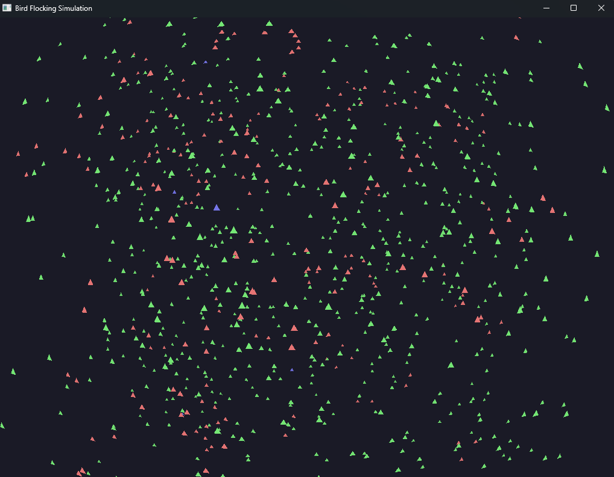

# Rust Flocking Simulator



This simulator demonstrates bird flocking behavior implemented in Rust using parallel processing.

When running the visual simulation, bird colour dictates what their strongest force is:

Green = **Cohesion**

Red = **Separation**

Blue = **Alignment**

## Basic Commands

**For regular visualization with FPS tracking:**

```
cargo run
```

**For raw computational benchmark of steps without graphics:**

```
cargo run -- benchmark                   # Default: 200 birds, 1000 steps
cargo run -- benchmark 500               # 500 birds, 1000 steps
cargo run -- benchmark 500 2000          # 500 birds, 2000 steps
cargo run -- benchmark 1000 500 --threads 8  # 1000 birds, 500 steps, 8 threads
```

**For scaling analysis across different flock sizes:**

```
cargo run -- scaling
```

## Thread Control Options

You can control the number of threads used for force calculation and position updates:

```
cargo run -- --threads <number>           # Set both thread pools to same value
cargo run -- --force-threads <number> --update-threads <number>  # Set separately
```

These parameters can be combined with any of the basic commands.

## Examples

**Visualize with custom thread counts:**

```
cargo run -- --threads 6               # Use 6 threads for both pools
cargo run -- --force-threads 8 --update-threads 4  # Different thread counts
```

**Run benchmark with custom thread configuration:**

```
cargo run -- benchmark 1000 --force-threads 16 --update-threads 8
```

**Run scaling test with specific number of threads:**

```
cargo run -- scaling --force-threads 2 --update-threads 2
```

## Thread Scaling Experiments

To test how well the simulation scales with different thread counts:

```
# Test with single thread (baseline)
cargo run -- benchmark 1000 --threads 1

# Test with 2 threads
cargo run -- benchmark 1000 --threads 2

# Test with 4 threads
cargo run -- benchmark 1000 --threads 4

# Test with 8 threads
cargo run -- benchmark 1000 --threads 8
```

Compare the performance reports to observe the scaling efficiency.

## Parameters

- `--threads`: Set both force and update thread pools to the same value
- `--force-threads`: Number of threads used for force calculations (separation, alignment, cohesion)
- `--update-threads`: Number of threads used for position updates
- `benchmark [birds] [steps]`: Run a performance benchmark with optional bird count and step count
- `scaling`: Run benchmarks across different flock sizes to test scaling

# FINAL LAB

## CPU Implementation

### Rust Code

The code is split across three files `bird.rs`, `flock_manager.rs`, and `main.rs`. `bird.rs` defines what a bird is, `flock_manager.rs` contains the logic for controlling the flock, spatial grid, performance measuring, and threading, `main.rs` contains the rendering pipeline and argument parsing.

**bird.rs**

```Rust
use nalgebra::Vector3;
use rand::Rng;

#[derive(Debug, Copy, Clone)]
pub struct Bird {
    pub position: Vector3<f32>,
    pub velocity: Vector3<f32>,
    pub acceleration: Vector3<f32>,
    pub max_speed: f32,
    pub max_force: f32,
    pub perception_radius: f32,
}

impl Bird {
    // Creates a new bird with random position and velocity
    pub fn new(min_bounds: &Vector3<f32>, max_bounds: &Vector3<f32>) -> Self {
        let mut rng = rand::thread_rng();

        let position = Vector3::new(
            rng.gen::<f32>() * (max_bounds.x - min_bounds.x) + min_bounds.x,
            rng.gen::<f32>() * (max_bounds.y - min_bounds.y) + min_bounds.y,
            rng.gen::<f32>() * (max_bounds.z - min_bounds.z) + min_bounds.z,
        );

        let velocity = Vector3::new(
            rng.gen::<f32>() * 2.0 - 1.0,
            rng.gen::<f32>() * 2.0 - 1.0,
            rng.gen::<f32>() * 2.0 - 1.0,
        )
        .normalize()
            * (rng.gen::<f32>() * 1.5 + 0.5);

        Self {
            position,
            velocity,
            acceleration: Vector3::zeros(),
            max_speed: 3.0,
            max_force: 0.1,
            perception_radius: 15.0,
        }
    }

    // Updates the birds velocity and position based on its acceleration
    pub fn update(&mut self, dt: f32) {
        self.velocity += self.acceleration * dt;

        if self.velocity.magnitude() > self.max_speed {
            self.velocity = self.velocity.normalize() * self.max_speed;
        }

        self.position += self.velocity * dt;
        self.acceleration = Vector3::zeros();
    }

    // Applies a force to the bird, affecting its acceleration
    pub fn apply_force(&mut self, force: Vector3<f32>) {
        self.acceleration += force;
    }

    // Ensures the bird stays within the simulation boundaries
    pub fn apply_boundaries(&mut self, min_bounds: &Vector3<f32>, max_bounds: &Vector3<f32>) {
        if self.position.x < min_bounds.x {
            self.position.x = max_bounds.x;
        }
        if self.position.y < min_bounds.y {
            self.position.y = max_bounds.y;
        }
        if self.position.z < min_bounds.z {
            self.position.z = max_bounds.z;
        }
        if self.position.x > max_bounds.x {
            self.position.x = min_bounds.x;
        }
        if self.position.y > max_bounds.y {
            self.position.y = min_bounds.y;
        }
        if self.position.z > max_bounds.z {
            self.position.z = min_bounds.z;
        }
    }
}
```

**flock_manager.rs**

```Rust
use crate::bird::Bird;
use nalgebra::Vector3;
use scoped_threadpool::Pool;
use std::sync::Arc;
use std::time::{Duration, Instant};

const CELL_SIZE: f32 = 30.0;
const EPSILON: f32 = 1e-6;
const SEPARATION_RADIUS_FACTOR: f32 = 0.3;

pub struct PerformanceMetrics {
    pub grid_update_time: Duration,
    pub force_calculation_time: Duration,
    pub position_update_time: Duration,
    pub steps_completed: usize,
    pub total_time: Duration,
}

impl PerformanceMetrics {
    pub fn new() -> Self {
        PerformanceMetrics {
            grid_update_time: Duration::new(0, 0),
            force_calculation_time: Duration::new(0, 0),
            position_update_time: Duration::new(0, 0),
            steps_completed: 0,
            total_time: Duration::new(0, 0),
        }
    }

    pub fn reset(&mut self) {
        *self = PerformanceMetrics::new();
    }

    pub fn report(&self) {
        println!("=== Performance Report ===");
        println!("Total steps: {}", self.steps_completed);
        println!("Total time: {:.3} seconds", self.total_time.as_secs_f32());
        println!(
            "Steps per second: {:.1}",
            self.steps_completed as f32 / self.total_time.as_secs_f32()
        );
        println!("Time breakdown:");
        println!(
            "  - Spatial grid updates: {:.3}s ({:.1}%)",
            self.grid_update_time.as_secs_f32(),
            self.grid_update_time.as_secs_f32() * 100.0 / self.total_time.as_secs_f32()
        );
        println!(
            "  - Force calculations: {:.3}s ({:.1}%)",
            self.force_calculation_time.as_secs_f32(),
            self.force_calculation_time.as_secs_f32() * 100.0 / self.total_time.as_secs_f32()
        );
        println!(
            "  - Position updates: {:.3}s ({:.1}%)",
            self.position_update_time.as_secs_f32(),
            self.position_update_time.as_secs_f32() * 100.0 / self.total_time.as_secs_f32()
        );
        let overhead = self.total_time.as_secs_f32()
            - (self.grid_update_time.as_secs_f32()
                + self.force_calculation_time.as_secs_f32()
                + self.position_update_time.as_secs_f32());
        println!(
            "  - Other/overhead: {:.3}s ({:.1}%)",
            overhead,
            overhead * 100.0 / self.total_time.as_secs_f32()
        );
        println!("=========================");
    }
}

struct SpatialGrid {
    cells: Vec<Vec<usize>>,
    dim_x: usize,
    dim_y: usize,
    dim_z: usize,
    min_bounds: Vector3<f32>,
    cell_size: f32,
}

impl SpatialGrid {
    fn new(min_bounds: &Vector3<f32>, max_bounds: &Vector3<f32>) -> Self {
        let dim_x = ((max_bounds.x - min_bounds.x) / CELL_SIZE).ceil() as usize + 1;
        let dim_y = ((max_bounds.y - min_bounds.y) / CELL_SIZE).ceil() as usize + 1;
        let dim_z = ((max_bounds.z - min_bounds.z) / CELL_SIZE).ceil() as usize + 1;
        let total_cells = dim_x * dim_y * dim_z;

        let mut cells = Vec::with_capacity(total_cells);
        for _ in 0..total_cells {
            cells.push(Vec::new());
        }

        SpatialGrid {
            cells,
            dim_x,
            dim_y,
            dim_z,
            min_bounds: *min_bounds,
            cell_size: CELL_SIZE,
        }
    }

    fn clear(&mut self) {
        for cell in &mut self.cells {
            cell.clear();
        }
    }

    fn get_cell_coords(&self, position: &Vector3<f32>) -> (usize, usize, usize) {
        let x_cell = ((position.x - self.min_bounds.x) / self.cell_size)
            .floor()
            .max(0.0)
            .min((self.dim_x - 1) as f32) as usize;
        let y_cell = ((position.y - self.min_bounds.y) / self.cell_size)
            .floor()
            .max(0.0)
            .min((self.dim_y - 1) as f32) as usize;
        let z_cell = ((position.z - self.min_bounds.z) / self.cell_size)
            .floor()
            .max(0.0)
            .min((self.dim_z - 1) as f32) as usize;
        (x_cell, y_cell, z_cell)
    }

    fn get_cell_index(&self, x: usize, y: usize, z: usize) -> usize {
        x + y * self.dim_x + z * (self.dim_x * self.dim_y)
    }

    fn get_overlapping_cells(&self, bird: &Bird) -> Vec<(usize, usize, usize)> {
        let perception_radius = bird.perception_radius;

        let min_pos = Vector3::new(
            bird.position.x - perception_radius,
            bird.position.y - perception_radius,
            bird.position.z - perception_radius,
        );

        let max_pos = Vector3::new(
            bird.position.x + perception_radius,
            bird.position.y + perception_radius,
            bird.position.z + perception_radius,
        );

        let (min_x, min_y, min_z) = self.get_cell_coords(&min_pos);
        let (max_x, max_y, max_z) = self.get_cell_coords(&max_pos);

        let mut overlapping_cells = Vec::new();
        for x in min_x..=max_x {
            for y in min_y..=max_y {
                for z in min_z..=max_z {
                    if x < self.dim_x && y < self.dim_y && z < self.dim_z {
                        overlapping_cells.push((x, y, z));
                    }
                }
            }
        }

        overlapping_cells
    }

    fn add_bird(&mut self, bird_idx: usize, bird: &Bird) {
        for (x_cell, y_cell, z_cell) in self.get_overlapping_cells(bird) {
            let cell_idx = self.get_cell_index(x_cell, y_cell, z_cell);
            if cell_idx < self.cells.len() {
                self.cells[cell_idx].push(bird_idx);
            }
        }
    }

    fn get_neighbor_indices(&self, bird: &Bird) -> Vec<usize> {
        let (x_cell, y_cell, z_cell) = self.get_cell_coords(&bird.position);
        let cell_idx = self.get_cell_index(x_cell, y_cell, z_cell);

        if cell_idx < self.cells.len() {
            self.cells[cell_idx].clone()
        } else {
            Vec::new()
        }
    }
}

pub struct FlockManager {
    pub current_birds: Arc<Vec<Bird>>,
    pub next_birds: Vec<Bird>,
    pub min_bounds: Vector3<f32>,
    pub max_bounds: Vector3<f32>,
    pub separation_weight: f32,
    pub alignment_weight: f32,
    pub cohesion_weight: f32,
    pub dominant_forces: Vec<usize>,
    spatial_grid: SpatialGrid,
    force_pool: Pool,
    update_pool: Pool,
    force_thread_count: usize,
    update_thread_count: usize,
    pub performance: PerformanceMetrics,
}

impl FlockManager {
    // Creates a new flock manager with the specified number of birds and thread counts
    pub fn new(
        num_birds: usize,
        min_bounds: Vector3<f32>,
        max_bounds: Vector3<f32>,
        force_threads: usize,
        update_threads: usize,
    ) -> Self {
        // Create birds in next_birds first
        let mut next_birds = Vec::with_capacity(num_birds);
        for _ in 0..num_birds {
            next_birds.push(Bird::new(&min_bounds, &max_bounds));
        }

        // Move birds into Arc without cloning
        let current_birds = Arc::new(std::mem::take(&mut next_birds));

        // Reserve capacity for next_birds for future use
        next_birds = Vec::with_capacity(num_birds);

        FlockManager {
            current_birds,
            next_birds,
            min_bounds,
            max_bounds,
            separation_weight: 3.0,
            alignment_weight: 1.0,
            cohesion_weight: 0.5,
            dominant_forces: vec![0; num_birds],
            spatial_grid: SpatialGrid::new(&min_bounds, &max_bounds),
            force_pool: Pool::new(force_threads as u32),
            update_pool: Pool::new(update_threads as u32),
            force_thread_count: force_threads,
            update_thread_count: update_threads,
            performance: PerformanceMetrics::new(),
        }
    }

    // Calculates the wrapped distance between two positions in a toroidal space
    fn calculate_wrapped_distance(
        pos1: &Vector3<f32>,
        pos2: &Vector3<f32>,
        min_bounds: &Vector3<f32>,
        max_bounds: &Vector3<f32>,
    ) -> Vector3<f32> {
        let size_x = max_bounds.x - min_bounds.x;
        let size_y = max_bounds.y - min_bounds.y;
        let size_z = max_bounds.z - min_bounds.z;

        let dx = pos1.x - pos2.x;
        let dy = pos1.y - pos2.y;
        let dz = pos1.z - pos2.z;

        let dx_wrap = dx - size_x * (dx / (size_x * 0.5)).round();
        let dy_wrap = dy - size_y * (dy / (size_y * 0.5)).round();
        let dz_wrap = dz - size_z * (dz / (size_z * 0.5)).round();

        Vector3::new(dx_wrap, dy_wrap, dz_wrap)
    }

    // Calculates separation, alignment and cohesion forces for a bird
    fn calculate_forces(
        bird_index: usize,
        birds: &[Bird],
        neighbor_indices: &[usize],
        min_bounds: &Vector3<f32>,
        max_bounds: &Vector3<f32>,
        separation_weight: f32,
        alignment_weight: f32,
        cohesion_weight: f32,
    ) -> (Vector3<f32>, Vector3<f32>, Vector3<f32>, usize) {
        let bird = &birds[bird_index];

        let mut separation_force = Vector3::zeros();
        let mut average_velocity = Vector3::zeros();
        let mut cohesion_center = Vector3::zeros();
        let mut neighboring_birds_count = 0;

        for &j in neighbor_indices {
            if bird_index == j || j >= birds.len() {
                continue;
            }

            let other_bird = &birds[j];
            let wrapped_diff = Self::calculate_wrapped_distance(
                &bird.position,
                &other_bird.position,
                min_bounds,
                max_bounds,
            );
            let dist_sq = wrapped_diff.magnitude_squared();

            if dist_sq > EPSILON
                && dist_sq
                    < (bird.perception_radius * SEPARATION_RADIUS_FACTOR)
                        * (bird.perception_radius * SEPARATION_RADIUS_FACTOR)
            {
                separation_force += wrapped_diff.normalize() * (1.0 / dist_sq);
            }

            if dist_sq < bird.perception_radius * bird.perception_radius {
                average_velocity += other_bird.velocity;

                let other_pos = bird.position - wrapped_diff;
                cohesion_center += other_pos;

                neighboring_birds_count += 1;
            }
        }

        let alignment_force = if neighboring_birds_count > 0 {
            average_velocity /= neighboring_birds_count as f32;
            let mut force = average_velocity - bird.velocity;

            if force.magnitude() > bird.max_force {
                force = force.normalize() * bird.max_force;
            }
            force
        } else {
            Vector3::zeros()
        };

        let cohesion_force = if neighboring_birds_count > 0 {
            cohesion_center /= neighboring_birds_count as f32;
            let desired_velocity = cohesion_center - bird.position;
            let mut force = desired_velocity;

            if force.magnitude() > bird.max_force {
                force = force.normalize() * bird.max_force;
            }
            force
        } else {
            Vector3::zeros()
        };

        let sep_force = separation_force * separation_weight;
        let align_force = alignment_force * alignment_weight;
        let coh_force = cohesion_force * cohesion_weight;

        let sep_mag = sep_force.magnitude();
        let align_mag = align_force.magnitude();
        let coh_mag = coh_force.magnitude();

        let dominant_force = if sep_mag > align_mag && sep_mag > coh_mag {
            0
        } else if align_mag > sep_mag && align_mag > coh_mag {
            1
        } else {
            2
        };

        (sep_force, align_force, coh_force, dominant_force)
    }

    // Gets a reference to the current birds for rendering
    pub fn get_birds(&self) -> &[Bird] {
        &self.current_birds
    }

    // Gets the total number of birds in the simulation
    pub fn get_bird_count(&self) -> usize {
        self.current_birds.len()
    }

    // Gets the dominant force for a specific bird
    pub fn get_dominant_force(&self, bird_index: usize) -> usize {
        self.dominant_forces[bird_index]
    }

    // Updates the flock simulation by one timestep
    pub fn update(&mut self, dt: f32) {
        let start_time = Instant::now();

        // Update spatial grid using current birds
        let grid_start = Instant::now();
        self.spatial_grid.clear();
        for (idx, bird) in self.current_birds.iter().enumerate() {
            self.spatial_grid.add_bird(idx, bird);
        }
        self.performance.grid_update_time += grid_start.elapsed();

        // Force calculation
        let force_start = Instant::now();

        // Pre-collect all neighbor indices
        let birds_with_neighbors: Vec<Vec<usize>> = self
            .current_birds
            .iter()
            .map(|bird| self.spatial_grid.get_neighbor_indices(bird))
            .collect();

        // Prepare thread local storage for results
        let birds_count = self.current_birds.len();
        let mut thread_results = vec![Vec::new(); self.force_thread_count];

        // Ensure next_birds is the right size
        if self.next_birds.len() != birds_count {
            self.next_birds = Vec::with_capacity(birds_count);
            self.next_birds.resize_with(birds_count, || {
                Bird::new(&self.min_bounds, &self.max_bounds)
            });
        }

        // Scope all Arc references to ensure they're dropped before buffer swap
        {
            // Copy configuration data that will be shared with threads
            let min_bounds = self.min_bounds;
            let max_bounds = self.max_bounds;
            let separation_weight = self.separation_weight;
            let alignment_weight = self.alignment_weight;
            let cohesion_weight = self.cohesion_weight;
            let thread_count = self.force_thread_count;
            let birds_arc = Arc::clone(&self.current_birds);
            let birds_with_neighbors_arc = Arc::new(birds_with_neighbors);
            let chunk_size = (birds_count + thread_count - 1) / thread_count;

            // Process in parallel
            self.force_pool.scoped(|scope| {
                for (thread_idx, thread_result) in thread_results.iter_mut().enumerate() {
                    let start_idx = thread_idx * chunk_size;
                    let end_idx = (start_idx + chunk_size).min(birds_count);

                    let birds_ref = Arc::clone(&birds_arc);
                    let neighbors_ref = Arc::clone(&birds_with_neighbors_arc);

                    let mut local_results = Vec::with_capacity(end_idx - start_idx);

                    scope.execute(move || {
                        for bird_idx in start_idx..end_idx {
                            // Calculate forces for this bird
                            let (sep, align, coh, dominant) = Self::calculate_forces(
                                bird_idx,
                                &birds_ref,
                                &neighbors_ref[bird_idx],
                                &min_bounds,
                                &max_bounds,
                                separation_weight,
                                alignment_weight,
                                cohesion_weight,
                            );

                            // Store result for this bird
                            local_results.push((bird_idx, sep, align, coh, dominant));
                        }

                        *thread_result = local_results;
                    });
                }
            });
            // All Arc clones are dropped here when this scope ends
        }

        // Apply forces to next_birds (sequential operation)
        //TODO : Realistically, this should be parallelized too but for now, it's not worth the effort
        for thread_result in &thread_results {
            for &(bird_idx, sep, align, coh, dominant) in thread_result {
                if bird_idx < self.next_birds.len() {
                    self.next_birds[bird_idx] = self.current_birds[bird_idx];
                    self.next_birds[bird_idx].apply_force(sep);
                    self.next_birds[bird_idx].apply_force(align);
                    self.next_birds[bird_idx].apply_force(coh);
                    self.dominant_forces[bird_idx] = dominant;
                }
            }
        }

        self.performance.force_calculation_time += force_start.elapsed();

        // Update positions in parallel
        let update_start = Instant::now();

        // Prepare data for position updates
        let update_thread_count = self.update_thread_count;
        let next_birds_len = self.next_birds.len();
        let min_bounds = self.min_bounds;
        let max_bounds = self.max_bounds;
        let chunk_size = (next_birds_len + update_thread_count - 1) / update_thread_count;

        // Split next_birds into chunks and process in parallel
        self.update_pool.scoped(|scope| {
            for next_birds_chunk in self.next_birds.chunks_mut(chunk_size) {
                let min_bounds_copy = min_bounds;
                let max_bounds_copy = max_bounds;

                scope.execute(move || {
                    for bird in next_birds_chunk {
                        bird.update(dt);
                        bird.apply_boundaries(&min_bounds_copy, &max_bounds_copy);
                    }
                });
            }
        });

        self.performance.position_update_time += update_start.elapsed();

        // Swap without cloning using mem::replace
        let old_birds = std::mem::replace(
            &mut self.current_birds,
            Arc::new(std::mem::take(&mut self.next_birds)),
        );

        // Try to reclaim the old buffer
        if let Ok(birds) = Arc::try_unwrap(old_birds) {
            self.next_birds = birds;
        } else {
            // If we can't unwrap (other references exist), create a new buffer
            // This should be rare in practice
            self.next_birds = Vec::with_capacity(birds_count);
        }

        self.performance.steps_completed += 1;
        self.performance.total_time += start_time.elapsed();
    }

    // Runs a benchmark for the specified number of steps
    pub fn run_benchmark(&mut self, steps: usize, dt: f32) {
        self.performance.reset();
        println!("Running benchmark for {} steps...", steps);

        for i in 1..=steps {
            self.update(dt);

            if i % 100 == 0 || i == steps {
                println!(
                    "Completed {} steps ({:.1}%)",
                    i,
                    (i as f32 / steps as f32) * 100.0
                );
            }
        }

        self.performance.report();
    }
}
```

**main.rs**

```Rust
//* Bird Flocking Simulation */
//* APRIL/MAY 2025 - Jayden Holdsworth */
#[macro_use]
extern crate glium;
extern crate nalgebra;
extern crate rand;
extern crate scoped_threadpool;
extern crate winit;
use nalgebra::{Matrix4, Perspective3, Point3, Vector3};
use std::env;
use std::time::Instant;
mod bird;
mod flock_manager;
use flock_manager::FlockManager;

//* SIMULATION CONFIG */
const FLOCK_SIZES: [usize; 4] = [100, 500, 1000, 5000];
const BENCHMARK_STEPS: usize = 1000;
const SCALING_TEST_STEPS: usize = 500;
const SIMULATION_TIMESTEP: f32 = 0.016; // 60 FPS equivalent

// Default values
const DEFAULT_NUM_BIRDS: usize = 1000;
const DEFAULT_FORCE_THREADS: usize = 4;
const DEFAULT_UPDATE_THREADS: usize = 4;
const DEFAULT_MIN_BOUNDS: Vector3<f32> = Vector3::new(-50.0, -50.0, -50.0);
const DEFAULT_MAX_BOUNDS: Vector3<f32> = Vector3::new(50.0, 50.0, 50.0);

//* VISUALIZATION CONFIG */
const WINDOW_WIDTH: f32 = 1024.0;
const WINDOW_HEIGHT: f32 = 768.0;
const WINDOW_TITLE: &str = "Bird Flocking Simulation";
const BIRD_COLORS: [[f32; 3]; 4] = [
    [0.9, 0.2, 0.2], // Separation (red)
    [0.2, 0.9, 0.2], // Alignment (green)
    [0.2, 0.2, 0.9], // Cohesion (blue)
    [0.7, 0.7, 0.7], // Default (gray)
];
const BACKGROUND_COLOR: (f32, f32, f32, f32) = (0.1, 0.1, 0.15, 1.0);

//* CAMERA CONFIG */
const CAMERA_POSITION: Vector3<f32> = Vector3::new(0.0, 0.0, 120.0);
const CAMERA_TARGET: Vector3<f32> = Vector3::new(0.0, 0.0, 0.0);
const CAMERA_UP: Vector3<f32> = Vector3::new(0.0, 1.0, 0.0);
const CAMERA_FOV: f32 = std::f32::consts::FRAC_PI_4;
const CAMERA_NEAR: f32 = 0.1;
const CAMERA_FAR: f32 = 1000.0;

//* PERFORMANCE MONITORING */
const REPORT_INTERVAL_SECS: u64 = 5;

fn main() {
    let args: Vec<String> = env::args().collect();

    // Default configuration
    let min_bounds = DEFAULT_MIN_BOUNDS;
    let max_bounds = DEFAULT_MAX_BOUNDS;
    let mut force_threads = DEFAULT_FORCE_THREADS;
    let mut update_threads = DEFAULT_UPDATE_THREADS;

    // Parse thread counts from arguments
    let mut i = 1;
    while i < args.len() {
        if args[i] == "--threads" && i + 1 < args.len() {
            if let Ok(count) = args[i + 1].parse() {
                force_threads = count;
                update_threads = count;
                i += 2;
                continue;
            }
        } else if args[i] == "--force-threads" && i + 1 < args.len() {
            if let Ok(count) = args[i + 1].parse() {
                force_threads = count;
                i += 2;
                continue;
            }
        } else if args[i] == "--update-threads" && i + 1 < args.len() {
            if let Ok(count) = args[i + 1].parse() {
                update_threads = count;
                i += 2;
                continue;
            }
        }
        i += 1;
    }

    // Parse command line arguments to determine mode
    if args.len() > 1 {
        match args[1].as_str() {
            "benchmark" => {
                let mut num_birds = DEFAULT_NUM_BIRDS;
                let mut benchmark_steps = BENCHMARK_STEPS;

                // Check if birds count is specified
                if args.len() > 2 && !args[2].starts_with("--") {
                    if let Ok(birds) = args[2].parse() {
                        num_birds = birds;
                    }

                    // Check if steps are also specified
                    if args.len() > 3 && !args[3].starts_with("--") {
                        if let Ok(steps) = args[3].parse() {
                            benchmark_steps = steps;
                        }
                    }
                }

                println!("Running performance benchmark with {} birds for {} steps (force threads: {}, update threads: {})",
                    num_birds, benchmark_steps, force_threads, update_threads);
                let mut flock = FlockManager::new(
                    num_birds,
                    min_bounds,
                    max_bounds,
                    force_threads,
                    update_threads,
                );
                flock.run_benchmark(benchmark_steps, SIMULATION_TIMESTEP);
                return;
            }
            "scaling" => {
                // Scaling test across different flock sizes
                println!("Running scaling test with various flock sizes (force threads: {}, update threads: {})",
                    force_threads, update_threads);
                for &size in &FLOCK_SIZES {
                    println!("\n=== Testing with {} birds ===", size);
                    let mut flock = FlockManager::new(
                        size,
                        min_bounds,
                        max_bounds,
                        force_threads,
                        update_threads,
                    );
                    flock.run_benchmark(SCALING_TEST_STEPS, SIMULATION_TIMESTEP);
                }
                return;
            }
            _ => {}
        }
    }

    run_interactive_mode(min_bounds, max_bounds, force_threads, update_threads);
}

fn run_interactive_mode(
    min_bounds: Vector3<f32>,
    max_bounds: Vector3<f32>,
    force_threads: usize,
    update_threads: usize,
) {
    use glium::{glutin, Surface};

    let event_loop = winit::event_loop::EventLoop::new();
    let wb = winit::window::WindowBuilder::new()
        .with_inner_size(winit::dpi::LogicalSize::new(WINDOW_WIDTH, WINDOW_HEIGHT))
        .with_title(WINDOW_TITLE);
    let cb = glutin::ContextBuilder::new().with_depth_buffer(24);
    let display = glium::Display::new(wb, cb, &event_loop).unwrap();

    #[derive(Copy, Clone)]
    struct Vertex {
        position: [f32; 3],
    }

    implement_vertex!(Vertex, position);

    let vertex1 = Vertex {
        position: [-0.5, -0.3, 0.0],
    };
    let vertex2 = Vertex {
        position: [0.0, 0.6, 0.0],
    };
    let vertex3 = Vertex {
        position: [0.5, -0.3, 0.0],
    };
    let shape = vec![vertex1, vertex2, vertex3];
    let vertex_buffer = glium::VertexBuffer::new(&display, &shape).unwrap();
    let indices = glium::index::NoIndices(glium::index::PrimitiveType::TrianglesList);

    let vertex_shader_src = r#"
        #version 140
        in vec3 position;
        uniform mat4 model;
        uniform mat4 view;
        uniform mat4 projection;
        out vec3 frag_pos;

        void main() {
            frag_pos = vec3(model * vec4(position, 1.0));
            gl_Position = projection * view * model * vec4(position, 1.0);
        }
    "#;

    let fragment_shader_src = r#"
        #version 140
        uniform vec3 bird_color;
        uniform vec3 camera_pos;
        in vec3 frag_pos;
        out vec4 color;

        void main() {
            float dist = distance(frag_pos, camera_pos);
            float attenuation = 1.0 / (1.0 + 0.001 * dist + 0.00001 * dist * dist);
            attenuation = clamp(attenuation, 0.3, 1.0);
            color = vec4(bird_color * attenuation, 1.0);
        }
    "#;

    let program =
        glium::Program::from_source(&display, vertex_shader_src, fragment_shader_src, None)
            .unwrap();

    let mut flock = FlockManager::new(
        DEFAULT_NUM_BIRDS,
        min_bounds,
        max_bounds,
        force_threads,
        update_threads,
    );

    //* Performance tracking variables */
    let mut last_update = Instant::now();
    let mut fps_counter = 0;
    let mut fps_timer = Instant::now();
    let mut fps_history = Vec::new();
    let mut total_frame_time = 0.0;
    let mut simulation_time = 0.0;
    let mut render_time = 0.0;

    let report_interval = std::time::Duration::from_secs(REPORT_INTERVAL_SECS);
    let mut last_report = Instant::now();

    event_loop.run(move |event, _, control_flow| {
        match event {
            winit::event::Event::WindowEvent { event, .. } => match event {
                winit::event::WindowEvent::CloseRequested => {
                    *control_flow = winit::event_loop::ControlFlow::Exit;

                    // Final performance report
                    if !fps_history.is_empty() {
                        let avg_fps = fps_history.iter().sum::<f32>() / fps_history.len() as f32;
                        let min_fps = fps_history.iter().fold(f32::INFINITY, |a, &b| a.min(b));
                        let max_fps = fps_history.iter().fold(0.0, |a: f32, &b| a.max(b));

                        println!();
                        println!("\n=== Final Performance Report ===");
                        println!("Bird count: {}", flock.get_bird_count());
                        println!("Average FPS: {:.1}", avg_fps);
                        println!("Min FPS: {:.1}", min_fps);
                        println!("Max FPS: {:.1}", max_fps);
                        println!("Time breakdown per frame:");
                        println!(
                            "  - Simulation: {:.2}ms ({:.1}%)",
                            simulation_time * 1000.0 / fps_counter as f32,
                            simulation_time * 100.0 / total_frame_time
                        );
                        println!(
                            "  - Rendering: {:.2}ms ({:.1}%)",
                            render_time * 1000.0 / fps_counter as f32,
                            render_time * 100.0 / total_frame_time
                        );
                        println!("Component breakdown in simulation:");
                        flock.performance.report();
                    }

                    return;
                }
                _ => return,
            },
            winit::event::Event::RedrawRequested(_) => {
                let now = Instant::now();
                let dt = now.duration_since(last_update).as_secs_f32();
                last_update = now;
                total_frame_time += dt;

                // Measure simulation time
                let sim_start = Instant::now();
                flock.update(dt);
                let sim_duration = sim_start.elapsed().as_secs_f32();
                simulation_time += sim_duration;

                // Measure rendering time
                let render_start = Instant::now();

                // Render scene
                let mut target = display.draw();
                target.clear_color_and_depth(BACKGROUND_COLOR, 1.0);

                let eye = Point3::new(CAMERA_POSITION.x, CAMERA_POSITION.y, CAMERA_POSITION.z);
                let target_point = Point3::new(CAMERA_TARGET.x, CAMERA_TARGET.y, CAMERA_TARGET.z);
                let up = CAMERA_UP;
                let view_matrix: [[f32; 4]; 4] =
                    *Matrix4::look_at_rh(&eye, &target_point, &up).as_ref();

                let perspective = Perspective3::new(
                    display.get_framebuffer_dimensions().0 as f32
                        / display.get_framebuffer_dimensions().1 as f32,
                    CAMERA_FOV,
                    CAMERA_NEAR,
                    CAMERA_FAR,
                );
                let projection_matrix: [[f32; 4]; 4] = *perspective.as_matrix().as_ref();

                for (i, bird) in flock.get_birds().iter().enumerate() {
                    let pos_x = bird.position.x;
                    let pos_y = bird.position.y;
                    let pos_z = bird.position.z;

                    let look_dir = Vector3::new(
                        CAMERA_POSITION.x - pos_x,
                        CAMERA_POSITION.y - pos_y,
                        CAMERA_POSITION.z - pos_z,
                    )
                    .normalize();
                    let up = CAMERA_UP;
                    let right = up.cross(&look_dir).normalize();
                    let adjusted_up = look_dir.cross(&right).normalize();

                    let model_matrix = [
                        [right.x, adjusted_up.x, look_dir.x, 0.0],
                        [right.y, adjusted_up.y, look_dir.y, 0.0],
                        [right.z, adjusted_up.z, look_dir.z, 0.0],
                        [pos_x, pos_y, pos_z, 1.0f32],
                    ];

                    let dominant_force = flock.get_dominant_force(i);
                    let bird_color = BIRD_COLORS[dominant_force.min(3)];

                    let uniforms = uniform! {
                        model: model_matrix,
                        view: view_matrix,
                        projection: projection_matrix,
                        bird_color: bird_color,
                        camera_pos: [CAMERA_POSITION.x, CAMERA_POSITION.y, CAMERA_POSITION.z],
                    };

                    target
                        .draw(
                            &vertex_buffer,
                            &indices,
                            &program,
                            &uniforms,
                            &glium::DrawParameters {
                                depth: glium::Depth {
                                    test: glium::draw_parameters::DepthTest::IfLess,
                                    write: true,
                                    ..Default::default()
                                },
                                ..Default::default()
                            },
                        )
                        .unwrap();
                }

                target.finish().unwrap();

                let render_duration = render_start.elapsed().as_secs_f32();
                render_time += render_duration;

                fps_counter += 1;

                //* Report FPS every interval */
                if last_report.elapsed() >= report_interval {
                    let current_fps = fps_counter as f32 / fps_timer.elapsed().as_secs_f32();
                    fps_history.push(current_fps);

                    println!(
                        "FPS: {:.1} | Birds: {} | Sim time: {:.2}ms | Render time: {:.2}ms",
                        current_fps,
                        flock.get_bird_count(),
                        (simulation_time / fps_counter as f32) * 1000.0,
                        (render_time / fps_counter as f32) * 1000.0
                    );

                    fps_counter = 0;
                    fps_timer = Instant::now();
                    last_report = Instant::now();
                    simulation_time = 0.0;
                    render_time = 0.0;
                }
            }
            winit::event::Event::MainEventsCleared => {
                display.gl_window().window().request_redraw();
            }
            _ => return,
        };
    });
}
```

### Explanation

Following my 2D particle simulation that I did in a previous lab, I was confident about this final lab. Because I spent a long time optimising that, I had a good base for what I wanted this bird flocking simulation to look like. In theory, this final lab is just the 2D particle simulation, just with another dimension and some more particle-specific code like coersion, alignment, and separation, the parallelisation architecture remained similar.

For this final lab, I used a spatial grid to divide the bounds into smaller cubes, allowing more efficient lookup of neighbouring birds. To reduce calculation time further, birds also compare their distance on 1 axis before continuing to measure the full distance. Birds are calculated as being in a cell of a spatial grid by their perception distance, if a bird can see a cell, it is in it. Therefore, birds can be in multiple cells, despite technically not actually residing in that particular cell. This is to ensure that 2 birds in neighbouring cells that are physically close can be correctly calculated. This is an optimisation I was trying out based on feedback from Warren Viant in the past lab where we had to create a 2D particle simulation, where previously I wrote code to search for the current cell in the spatial grid, along with its 8 neighbours. If I implemented that here, the program would have to search through 27 neighbours due to the extra dimension, still more efficient than looking at every other bird in the simulation, but still much less efficient in 3D.

The assignment brief specified how we were meant to parallelise the CPU solution, by splitting up birds into concurrent groups.

Again, taking inspiration from my previous lab work, I employed a double-buffering approach where i maintain two separate collections of birds, `current_birds` (wrapped in an Arc) and `next_birds` (standard Vec). This technique is essential because it allows the simulation to compute the next state of all birds without modifying their current state during force calculations. When all birds are updated, the buffers are swapped using `mem::replace` and `mem::take`, avoiding expensive copying operations. Without this double buffer, I would either need to clone the entire flock each frame, which is extremely inneficient, or use complex locking mechanisms that would severely impact parallelism. The double bufffer approach also simplifies the force calculation phase as threads can safely read the current state of all birds without worrying about race conditions or data inconsistencies that would occur if birds were updated in place.

For thread management, the simulation utilises two separate scoped threadpools from the `scoped_threadpool` crate, one is for force calcuations and the other is for position updates. These scoped threadpools are particularly useful because they guarantee that all spawned threads will complete before the scope ends, elimating potential data races and dangling references. Due to this scoped threads can safely borrow data from their parent scope because they are guaranteed to terminate. In my implementation, the force pool performs the complex N-body calculations where the birds interact with their neighbours, while ht eupdate pool handles the simpler position and rotation updates. This division allows me to optimise thread counts separately for computation-heavy force calculations versus the lighter update operations. For example, assigning 12 force threads and 4 update threads. Each threadpool creates chunks of birds based on the available thread count, ensuring even distribution of work across CPU cores.

To disuade excessive cloning throughout the simulation, I extensively use Rust's `Arc` for shared immutable access to bird data. When multiple threads need to read the same positions and velocities during force calculations, Arc allows them to share this data without duplicating it. This is accomplished by wrapping `current_birds` in an Arc and then having each worker thread create a lightweight clone of the Arc pointer (not the underlying data). This approach is great, because previously I was deep copying the entire flock for each thread, which is much less efficient. The Arc wrapper ensures that data remains valid untill all threads finish using it, at which point I attempt to reclaim the buffer with `Arc::try_unwrap()`. In the rare case when some other part of the program still holds a reference, the code falls back to allocating a new buffer, ensuring the simulation continues to run efficiently without memory leaks or excessive allocations.

For boundary handling, I implemented a torodial world where birds that exit one side of the simulation reappear on the opposite side. In the `apply_boundaries` method, each bird's position is checked against the minimum and maximum bounds on all three aces. If a bird exceeds any boundary, its position is wrapped to the opposite side of the simulation space. I implemented a wrapped distance calculation function which computes the shortest distance between two birds in this toroidal space. This is crucial for accurate force calculations, as without it, birds near opposite boundaries would incorrectly percieve a large distance between them. Originally, birds would just have a check to see if they are outside of bounds, of which it would just teleport them to the opposite side, but ofcourse this messes up the distance related calculations.

The three core features that govern bird behaviour are separation, alignment, and cohesion. These forces are very self-explanatory in how they control bird behaviour, and each force is capped at the bird's maximum force capability and weighted differently to achieve a natural looking flocking behaviour. After calculating all three forces, their magnitudes are compared to determine the dominant force, which is used for giving the birds unique colour.

To add some visual distinction to the birds, colour coding was employed. Birds are coloured based on their most dominant force, green is cohesion, blue is alignment, and red is separation. Besides being more visually appealing to look at, this feature aided in development and facilitated a much greater understanding on an individual bird's behaviour at a given moment. A decent portion of the code located in my `main.rs` was already provided to us, this made rendering the birds as triangles in OpenGL much easier than if we were not given this. When running the visual simulation, periodically it will print to the console, showcasing the current FPS, number of birds, simulation time (in ms), and rendering time (in ms). When the visual simulation is closed, it will give a performance report:

```
PS D:\Files\Documents\AProjects\Rust\bird-flocking> cargo run --release
    Finished `release` profile [optimized] target(s) in 1.04s
     Running `target\release\bird-flocking.exe`
FPS: 574.5 | Birds: 1000 | Sim time: 0.73ms | Render time: 0.58ms
FPS: 682.6 | Birds: 1000 | Sim time: 0.71ms | Render time: 0.57ms
FPS: 672.2 | Birds: 1000 | Sim time: 0.72ms | Render time: 0.57ms
FPS: 657.1 | Birds: 1000 | Sim time: 0.74ms | Render time: 0.58ms
FPS: 606.2 | Birds: 1000 | Sim time: 0.78ms | Render time: 0.65ms
FPS: 495.1 | Birds: 1000 | Sim time: 0.91ms | Render time: 0.88ms
FPS: 497.6 | Birds: 1000 | Sim time: 0.91ms | Render time: 0.88ms
FPS: 490.9 | Birds: 1000 | Sim time: 0.93ms | Render time: 0.88ms
FPS: 541.1 | Birds: 1000 | Sim time: 0.87ms | Render time: 0.74ms
FPS: 633.0 | Birds: 1000 | Sim time: 0.78ms | Render time: 0.58ms


=== Final Performance Report ===
Bird count: 1000
Average FPS: 585.0
Min FPS: 490.9
Max FPS: 682.6
Time breakdown per frame:
  - Simulation: 0.80ms (0.7%)
  - Rendering: 0.58ms (0.5%)
Component breakdown in simulation:
=== Performance Report ===
Total steps: 29679
Total time: 23.648 seconds
Steps per second: 1255.0
Time breakdown:
  - Spatial grid updates: 2.992s (12.7%)
  - Force calculations: 19.517s (82.5%)
  - Position updates: 1.124s (4.8%)
  - Other/overhead: 0.015s (0.1%)
=========================
```

To control whether or not the visualisation should run, the bird count, and the thread count, the program accepts parameters before running. The default `cargo run --release` runs the visualisation, with the default birdcount (1000), with the default number of threads (4 update threads, 4 force calculation threads). To run without visualisation, the command is `cargo run --release -- benchmark` which will run a benchmark test, giving a performance report at the end. To change the bird count or steps with this benchmark the command is `cargo run --release -- benchmark [birds] [steps]`. To alter the thread count, you can add it to the command with `--threads [threads]`. Here is an example of a benchmark performance report for 500 birds at 500 steps with a thread count of 8:

```
PS D:\Files\Documents\AProjects\Rust\bird-flocking> cargo run --release -- benchmark 500 500 --threads 8
    Finished `release` profile [optimized] target(s) in 1.39s
     Running `target\release\bird-flocking.exe benchmark 500 500 --threads 8`
Running performance benchmark with 500 birds for 500 steps (force threads: 8, update threads: 8)
Running benchmark for 500 steps...
Completed 100 steps (20.0%)
Completed 200 steps (40.0%)
Completed 300 steps (60.0%)
Completed 400 steps (80.0%)
Completed 500 steps (100.0%)
=== Performance Report ===
Total steps: 500
Total time: 0.163 seconds
Steps per second: 3064.2
Time breakdown:
  - Spatial grid updates: 0.023s (14.1%)
  - Force calculations: 0.110s (67.5%)
  - Position updates: 0.030s (18.2%)
  - Other/overhead: 0.000s (0.1%)
=========================
PS D:\Files\Documents\AProjects\Rust\bird-flocking>
```

### Potential Improvements & Other Parallelization Architecture

## GPU Implementation

### Code

### Explanation

Following my

### Potential Improvements & Other Parallelization Architecture

## Performance Comparison

## Reflection
